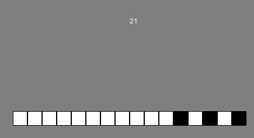
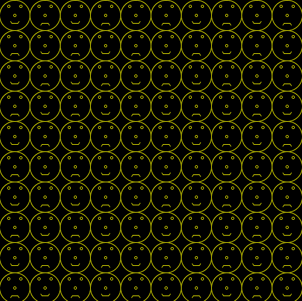

OOP Programming Labs
====================

Lab 4
-----
For this lab you will be making a sketch that allows the user to convert between binary and decimal using a graphical tool that looks like this:



The user should be able to click any one of the squares to "toggle" a bit on or off. The number in decimal should automatically change. For example, in the screenshot above, bits 0, 2 and 4 are turned on so the number is 1 + 4 + 16 = 21. 

To complete the sketch you can use a boolean array. Remember arrays from first year? Arrays are a  collection of data all of the same type. Read  [this article that explians how arrays work in Processing](http://www.processing.org/reference/Array.html). A boolean array is just an array where every element is either trur or false.

Here is a skeleton sketch to get you started if you need it, but *feel free to ignore this and just come up with your own solution*:

```Java
boolean[] bytes = new boolean[16];
int centX, centY;

// Probably need to declare some more variables here


void setup()
{
  size(500, 500);
  centX = width / 2;
  centY = height / 2;  
  
<<<<<<< HEAD
  // And set their values here
=======
  // And set their valuse here
>>>>>>> binaryNums
}


void draw()
{
  background(127);
  // Do some stuff here
  
  int number = binaryToDecimal(bytes);
  // This is how you print text in Processing
  fill(255);
  text(number, centX, 100);
}

int binaryToDecimal(boolean[] bytes)
{
  int ret = 0;
  
<<<<<<< HEAD
  // Implement this method
=======
  // Implement this function
>>>>>>> binaryNums
  
  return ret;
}

void mousePressed()
{
  // Put some code here too
  // To toggle the bit on or off based on the mouse position.
}
```

What I suggest you do is:

- Implement the method ```int binaryToDecimal(boolean[] bytes)```. 
- Set some of the bits in the bits array to be true and test the method you wrote by printing out the value.
- Write code in the ```draw()``` method to draw boxes to represent the bits. The box should be black only if the appropriate bit is true.
- Write code in the ```mousePressed()``` method to calculate which if any box the user has pressed the mouse onto and toggle the appropriate bit.

### Bonus!
- Print the bit numbers over the boxes
- Implement 2's complement.
- Colours! Lights! Animations!

Lab 3
-----
Check out the example Spiral skeches and the various examples we made in the class on Monday. Use loops to recreate some of [these geometric patterns from everyday life](https://plus.google.com/u/1/photos/102641008582291248101/albums/6064398604152239873). 

Try and choose at least one image that uses just loops and at least one image that uses some trigonometry. Upload your examples through webcourses. I will award a prize for the most beautiful geometric patternms in Friday's tutorial class.

Lab 2
-----
### Part 1

Make a rollover button in Processing. The button should be centred on the window and take up 30% of the width and height of the window. When you roll the mouse over the button, it should change colour from grey to blue:
Advanced! Make the button into a toggle (click on/click off) button. The button should go red when it is toggled on. In order to do this, you need to make use of the following method in your sketch:

```Java
void mousePressed()
```

This method will get called by the Processing framework whenever the mouse in pressed in the window where your sketch is running. Here is a youtube video with the completed sketch:

<a href="http://www.youtube.com/watch?feature=player_embedded&v=YGlGRnQoDFY
" target="_blank"></a>

### Part 2
Implement a bouncing ball. It should move diagonally in your sketch and "bounce" off the walls.

Lab 1
-----

Take the time to look up the following methods in the [Processing language reference](http://processing.org/reference/ ) to make sure you are clear about the syntax and parameters:

* line
* ellipse
* rect
* background
* stroke
* fill
* size

The first thing you need to do is complete the processing sketch we were working on in the class. Here are two shapes you can draw:


Try experimenting with colours!

Now try and figure out how to procedurally draw these patterns:


(Use variables as much as possible and use a loop in your solution)

Now try this one:


Finally try this one:



Notice the mouths

Feel free to experiment with colour!  
